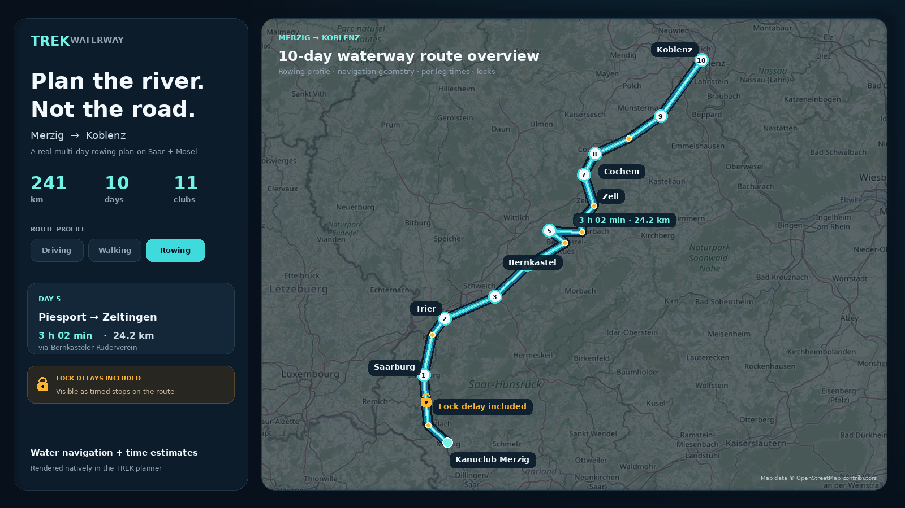

# trek-plugin-waterway

> Route day-plan legs along OpenStreetMap rivers, canals, and fairways.

Integration plugin for TREK 4.x that registers **canoe**, **kayak**, and **rowing** route profiles via `hook:route-provider`. Day-plan waypoints are snapped to the nearest profile-compatible OSM waterway segment, pathfound on a directed graph, and timed using profile-specific average speeds plus rough lock delays.

On the TREK planner this is the native day route: waterway geometry is the map line, per-leg times show on the sidebar connectors, lock dots sit on the line with dwell-time tooltips, and each leg also gets a midpoint via labelled with paddle/row time and distance so those times are available on the map itself.

AI agents connected through TREK MCP can call
`plugin_waterway_estimate_route` to evaluate the same route engine directly.
The tool returns bounded, structured estimates rather than requiring an agent
to scrape the planner UI.

## What it does

- Registers `canoe`, `kayak`, and `rowing` as day-plan route profiles next to Driving/Walking
- Fetches waterway geometry and locks from [Overpass API](https://overpass-api.de/) in one query so the host's 20 s `getRoute` budget is enough for a typical day
- Filters obvious non-navigable or unsuitable segments by OSM access, oneway, barrier, portage, canoe-pass, and whitewater tags
- Warns when no mapped put-in or take-out is found near a routed leg
- Detects nearby OSM locks and adds an average lock delay to rough duration estimates
- Caches Overpass responses in the plugin's own SQLite database (`db:own`)
- Returns the TREK 4.2 route shape: coordinates, distance in metres, duration in seconds, per-leg totals, routing notes (≤120 chars), and via points (duration markers + locks, ≤40)
- Publishes an MCP route-estimation tool with per-leg metrics, lock delays,
  warnings, and optional geometry simplified to at most 200 coordinates

This provider is a route-estimation aid, not an authoritative navigation product. It deliberately does not yet do tidal context, current modelling, official notices, water levels, portage instructions, or multi-section trip-template creation.

## Screenshots



The store cover is `docs/screenshot.png`. It is generated from the real
Merzig–Koblenz fixture coordinates over OpenStreetMap and shows the planner
surface this plugin changes: a Rowing profile, numbered route days, rowing
clubs, the waterway overlay, a per-leg time, and a lock-delay marker.

## Permissions

| Permission | Why |
|---|---|
| `hook:route-provider` | Implements `hooks.routeProvider.getRoute` |
| `mcp:tools` | Publishes `plugin_waterway_estimate_route` to explicitly authorized TREK MCP clients |
| `db:own` | Persists Overpass cache between requests and restarts |
| `http:outbound:overpass-api.de` | Fetches waterway data from Overpass |

## Setup

Set optional instance config in Admin -> Plugins -> Waterway. Manifest `default` values are used until you change them:

```json
{
  "overpassUrl": "https://overpass-api.de/api/interpreter",
  "canoeSpeedKmh": 5,
  "kayakSpeedKmh": 6,
  "rowingSpeedKmh": 8,
  "defaultLockDelayMinutes": 15
}
```

When `overpassUrl` is omitted, the default is `https://overpass-api.de/api/interpreter`. The mirror hostname must be listed in the plugin manifest `egress` array if you fork this plugin for a custom host.

Profile speed defaults are 5 km/h for canoe, 6 km/h for kayak, and 8 km/h for rowing. The legacy `speedKmh` config key is still accepted as a fallback for older local instances, but new installs should use the profile-specific keys. `defaultLockDelayMinutes` is added once per detected lock and defaults to 15.

Admins can clear the Overpass cache with **Purge Overpass cache** on the plugin's instance settings dialog.

For AI planning, reconnect the MCP client after activating or updating the
plugin, and grant its TREK OAuth token the `plugins:use` scope. The tool accepts
two to thirty ordered waypoints and one of the declared watercraft profiles.
It does not modify the trip: use TREK's existing MCP day/place tools to save
the selected stops and set `plugin:waterway/<profile>` as the day or leg mode.

## Local development

Requires Node ≥ 22.12 and npm. The published
[`trek-plugin-sdk`](https://www.npmjs.com/package/trek-plugin-sdk) package is
installed as a development dependency.

```bash
npm ci
npm test
npm run validate
npm run ci
npm run dev
```

`npm run dev` starts the SDK dev server with a real plugin database and injected `trek-plugin-sdk`. The plugin does not require a running TREK instance for unit tests — use `createMockHost` from `trek-plugin-sdk/testing` (see `tests/`).

## Routing scope

The profiles share the same route-provider contract but apply different suitability rules:

- `canoe` and `kayak` can use mapped canoe passes and short mapped portages, reject access-denied segments, and reject whitewater above grade 1.
- `rowing` avoids mapped portages, canoe passes, rapids, and any whitewater grade because those are not appropriate assumptions for rowing shells.
- `waterway` is kept as a legacy request alias for `canoe`; it is no longer advertised in the manifest.

TREK calls `getRoute({ tripId, dayId, profile, waypoints }, ctx)` with a 20 s timeout. A throw or timeout falls back to straight lines, the same as an OSRM outage. The plugin aborts its own Overpass work at 18 s and asks Overpass to finish each query within 12 s. MCP tool calls have a 15 s host limit, so the direct estimate uses a 13 s route budget and returns at most 200 geometry coordinates.

See the [Merzig to Koblenz 10-day test plan](docs/examples/merzig-koblenz.md)
for a machine-tested, DRV Gewässerkatalog-based route along the Saar and
Mosel. It targets roughly 25 km/day, visits eleven rowing facilities, and uses
public landings where club spacing makes 25–30 km club-to-club stages
impossible. The earlier
[Mettlach planning sketch](docs/examples/mettlach-koblenz.md) remains as a
shorter human-readable example. The plugin validates and estimates the day
routes; it does not yet create the TREK trip automatically.

## Project layout

```
trek-plugin.json          Manifest (id: waterway, routeProfiles capability)
server/index.js           Plugin entry — onLoad, instance action, hooks.routeProvider
server/overpass.js        Overpass client with db-backed cache
server/waterway/          Graph/snap/pathfind engine (pure JS)
tests/fixtures/           Deterministic OSM-like route and lock fixtures
tests/                    Vitest suite with mocked fetch
docs/examples/            Human-readable trip planning examples
```

## Testing

Required tests run standalone without TREK core and without live Overpass:

- `tests/waterway-routing.test.js` — graph engine behaviour, including access denial, directed segments, portages, canoe passes, whitewater policy, and lock extraction
- `tests/plugin.test.js` — manifest validation, `getRoute` contract, map via times, profile speeds, lock delay, db cache behaviour, invalid host requests
- `tests/overpass-client.test.js` — encoded Overpass requests, db cache hits, stale refresh, HTTP failures
- `tests/trek-host-contract.test.js` — TREK-style discovery/enabling/invocation against deterministic OSM fixtures
- `tests/trek-route.test.js` — duration labels and TREK vertex/note budgets
- `tests/mcp-tool.test.js` — direct agent route estimates, lock summaries, bounded geometry, and errors
- `tests/merzig-koblenz-trip.test.js` — ten connected rowing days from Merzig to Koblenz, club visits, stage chainage, and map/time output
- `tests/live-merzig-koblenz.test.js` — optional end-to-end routing of those ten days against current Overpass/OSM data
- `tests/sdk-cli.test.js` — SDK validator CLI exit contract
- `tests/intent.test.js` — scoped check against the original rowing-planner intent for this first provider slice

```bash
npm test
npm run validate
npm run pack
```

`npm run ci` runs the required release checks in order: tests, SDK validation, and packaging.

A live Overpass smoke test is available for pre-release confidence, but it is intentionally not part of required CI because OSM data, rate limits, and network availability are outside the plugin's control:

```bash
npm run test:live
```

GitHub Actions installs the pinned dependencies from `package-lock.json` and
runs `npm run ci` on Node 22.12.

## Building a release artifact

```bash
npm run pack
```

Produces `plugin.zip` suitable for the TREK plugin registry.

The registry store card reads `docs/screenshot.png` at the pinned commit. The
committed 1600×900 image is a browser capture from TREK 4.2 with this plugin
dev-linked and active. It shows Day 5 of the Merzig–Koblenz plan using the
Rowing profile, real OSM waterway geometry, route times, distances, and lock
markers. See `docs/screenshots/README.md` for the capture checklist.

To create and verify the immutable signed GitHub release:

```bash
npx trek-plugin-sdk release . \
  --repo thiesmoeller/trek-plugin-waterway \
  --tag v1.1.0 \
  --sign
npx trek-plugin-sdk preflight \
  --repo thiesmoeller/trek-plugin-waterway \
  --tag v1.1.0
```

After preflight passes, `trek-plugin-sdk submit` performs the separate
TREK-Plugins registry submission.

## License

MIT
